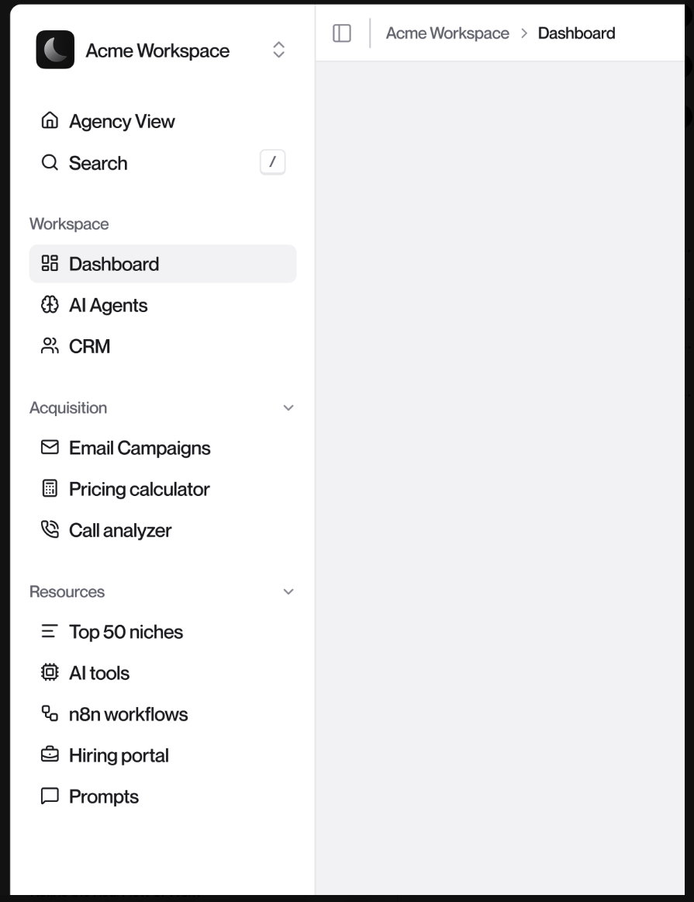
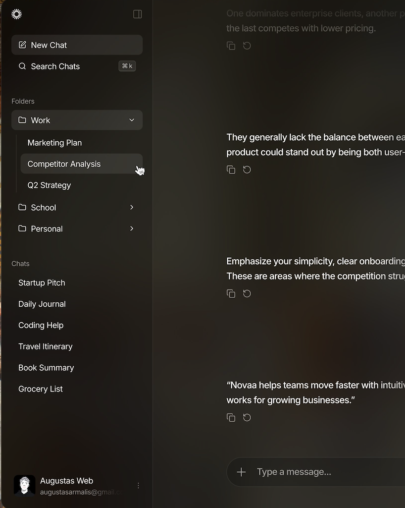

# Prompt para Agente (Claude) – Redesign Minimalista + Glass Sutil

## Contexto

- Projeto: Angular (speedclip-web), SASS, SPA.
- Domínio do produto: Content-to-Ad Creator (Cortes de vídeo e publicação em redes sociais).
- Público: criadores de conteúdo. Dispositivos: 50/50 mobile/desktop.
- Estilo desejado: minimalismo clean + toque sutil de glassmorphism.

## Objetivo

Atualizar tema e layout para minimalismo com glass sutil, aplicando via design tokens e componentes
base, com acessibilidade e performance AA/90+ no Lighthouse.

## Escopo de aplicação

- Global: por meio de tokens SCSS e design tokens TS (sem hardcode de cores).
- Glassmorphism: apenas no Header (Topbar). Não aplicar glass em cards, listas, tabelas ou quaisquer
  outros elementos por padrão.
- Preparação futura: criar somente a classe SCSS .glass-card (ver seção abaixo), mas NÃO
  aplicar/usar em nenhum template/componente ainda.
- Páginas/áreas afetadas:
    - Dashboard: speedclip-web/src/app/features/dashboard/pages/*
    - Content Creator (Input/Preview): speedclip-web/src/app/features/content-creator/pages/*
    - Layout principal (header/topbar, containers): speedclip-web/src/app/layouts/main-layout/*
    - Auth: manter minimalista, sem glass.

## Estilo obrigatório

- Minimalismo:
    - Espaço em branco generoso (grid base 8px; seções 80–120px).
    - Máx. 3 elementos-chave por seção.
    - Tipografia com hierarquia clara; line-height ≥ 1.6.
    - Paleta neutra/sóbria + 1 acento discreto.
    - Microinterações discretas; foco no conteúdo.
- Glass (controlado):
    - background com alpha baixo (≈ 6–8%), ex.: rgba(255,255,255,0.06) no tema dark.
    - backdrop-filter: blur 8–12px; saturate leve.
    - Borda 1px sutil (ex.: rgba(255,255,255,0.12)).
    - Sombras ausentes ou bem leves; evitar múltiplas camadas.
    - Performance: não usar em listas longas/áreas com scroll pesado.

## Cores

- Traga 2–3 paletas AA e recomende 1. Eu aprovo antes de aplicar.
- Fallback se não houver resposta:
    - Dark: bg #0B0D0F, surface #121417, text #EAECEF, muted #9AA3AF, accent #5B8DEF.
    - Light: bg #F7F7F8, surface #FFFFFF, text #1B1F24, muted #6B7280, accent #2563EB.

## Referências visuais (inspiração, não cópia)

Use as imagens abaixo apenas como direção estética para calibrar densidade, hierarquia tipográfica,
proporção de espaços e sutileza do glass. Não reproduza layouts, textos ou marcas; traduza os
princípios para os nossos componentes e tokens.

- Referência 1 – Sidebar/dashboard minimalista (light):
  
- Referência 2 – Minimalismo + Glass sutil (dark):
  

Como aplicar as referências:

- Extraia: níveis de contraste, espaçamentos entre seções (80–120px), densidade de cards, bordas de
  1px, blur de 8–12px, uso de 1 cor de acento.
- Da Referência 1 especificamente: sidebar leve com divisores sutis de 1px, estados selecionados
  discretos, hierarquia clara; não aplicar glass na sidebar.
- Da Referência 2: topbar com glass sutil; conteúdos principais sem glass, foco em superfície neutra
  e tipografia.
- Traduza para tokens e estilos base (tipografia, espaçamentos, cores) antes de mexer nos templates.
- Preserve acessibilidade: confirme AA em texto normal e estados hover/focus.

Critérios baseados nas referências:

- O resultado deve parecer igualmente “respirável”, com 2–3 elementos-chave por seção e glass apenas
  no Topbar.
- Nada de sombras pesadas ou múltiplas camadas; glass é acento, não protagonista.

## Arquivos-alvo (editar via tokens, sem hardcode)

- SCSS
    - speedclip-web/src/styles/
- TypeScript
    - speedclip-web/src/app/shared/constants/design-tokens.ts (espelhar as cores/tokens)
    - speedclip-web/src/app/core/services/theme.service.ts (integrar tokens se aplicável)
- Layouts/Componentes de aplicação
    - speedclip-web/src/app/layouts/main-layout/topbar/* (aplicar glass)
    - speedclip-web/src/app/features/*
    - speedclip-web/src/app/shared/components/* (buttons, etc.)

## Design tokens (preferência)

- Colors: --color-bg, --color-surface, --color-text, --color-text-muted, --color-primary,
  --color-accent.
- Glass: --glass-bg (rgba), --glass-blur (8–12px), --glass-border (1px rgba), --glass-shadow (leve
  ou none).
- Spacing: xs 8, sm 16, md 24, lg 48, xl 80, section 80–120.
- Type: base 16, lg 20, xl 24, 2xl 32, 3xl 48; line-heights: 1.25/1.6/1.8.
- Transitions: 0.15s/0.3s/0.5s ease.

## Política de tokens, reuso e limpeza de SCSS

- Reuso primeiro: antes de criar tokens novos, mapeie e reutilize variáveis existentes em
  abstracts/tokens.scss e abstracts/variables.scss. Não duplique nomes; se precisar renomear por
  consistência, crie alias temporário e migre as ocorrências.
- Varredura anti-hardcode: faça um sweep em src/**/*.scss e src/**/*.html procurando cores e valores
  “mágicos”. Substitua por tokens.
    - Procurar (exemplos): /#[0-9a-fA-F]{3,8}/, rgba\(.*\), hsla?\(.*\), box-shadow, border-color,
      background(-color)?.
    - Substituir por: var(--color-*) e tokens de espaçamento/tipografia.
- Remoção de sujeira: elimine variáveis não utilizadas, imports redundantes e estilos mortos.
  Consolide duplicatas em components/ e layouts/ usando mixins/utilitários.
- Single source of truth: todas as cores passam por CSS Custom Properties. Se existir variável SCSS
  equivalente, faça ela apontar para a CSS var (ex.: $color-text: var(--color-text)).
- TS em sincronia: atualize shared/constants/design-tokens.ts para refletir os mesmos
  nomes/valores (para ThemeService e stories/tests).

## Temas (Light e Dark)

- Manter paridade completa entre temas claro e escuro.
- Escopo dos tokens por tema:
    - :root[data-theme='light'] { …tokens light… }
    - :root[data-theme='dark'] { …tokens dark… }
- ThemeService:
    - Usar app/core/services/theme.service.ts para aplicar/remover data-theme no <html>.
    - Persistir escolha (localStorage) e respeitar prefers-color-scheme como default.
    - Expor toggleTheme() e getCurrentTheme().
- Estados/contraste: validar AA em ambos os temas, incluindo hover/focus/disabled.

## Classe de Card com Glass (definir, não usar ainda)

- Local: styles/components/cards.scss
- Adicionar a classe utilitária .glass-card com base nos tokens:
    - background: var(--glass-bg);
    - backdrop-filter: blur(var(--glass-blur));
    - -webkit-backdrop-filter: blur(var(--glass-blur));
    - border: var(--glass-border);
    - box-shadow: var(--glass-shadow, none);
    - border-radius: var(--radius-card, 12px);
    - padding: var(--spacing-lg);
- Não aplicar essa classe em nenhum template/HTML/Angular por enquanto. Não importar dinamicamente.

## Componentes alvo

- Header (Topbar):
    - Glass controlado (tokens acima), navegação responsiva, foco/hover AA.
- Classe SCSS para card (não aplicar):
    - .glass-card criada em styles/components/cards.scss apenas para uso futuro.
- MinimalButton:
    - Variants: filled/outline/ghost; tamanhos: sm/md/lg; estado loading.
    - Hovers/focus com contraste AA; área de foco visível.
- Forms/Links:
    - Estados focus/invalid claros; validações visuais discretas.

## Processo de trabalho

1) Propor plano em 5–8 bullets e 2–3 paletas AA; recomendar 1.
2) Após aprovação, atualizar tokens SCSS + shared/constants/design-tokens.ts; integrar com
   ThemeService se existir.
3) Executar sweep de limpeza: remover hardcodes, migrar para tokens, apagar variáveis mortas.
4) Ajustar base (tipografia, espaçamento) e componentes (buttons, cards, forms, links) usando
   tokens.
5) Aplicar glass somente no Topbar. Criar a classe .glass-card em styles/components/cards.scss, mas
   não usá-la em nenhum elemento.
6) Entregar diffs por arquivo com breve justificativa de cada mudança.

## Crit��rios de aceitação

- Acessibilidade: contrastes AA em texto e elementos interativos (incl. hover/focus/disabled).
- Glass restrito exclusivamente ao Topbar; nenhum outro elemento com backdrop-filter/var(--glass-*)
  ativo.
- A classe .glass-card existe em styles/components/cards.scss e não é referenciada em nenhum
  HTML/SCSS (grep por "glass-card" retorna apenas a definição).
- Zero hardcode de cores; tudo via tokens em SCSS/TS; variáveis não utilizadas removidas.
- Temas: claro e escuro funcionais, persistência no ThemeService e respeito a prefers-color-scheme.
- Responsividade: 320/768/1024/1200+.
- Lighthouse: ≥ 90 (Desktop) com CLS < 0.1 e TBT < 200ms.

## Não fazer

- Não aplicar glass em cards, listas, tabelas ou backgrounds de página inteira.
- Não usar sombras fortes, gradientes chamativos, ou múltiplas camadas de blur.
- Não criar tokens fora de abstracts/tokens.scss ou shared/constants/design-tokens.ts.
- Não usar/atribuir a classe .glass-card em nenhum componente até nova instrução.

## Perguntas que deve fazer se necessário

- Qual paleta aprovada? Manter logo/brand atual?
- Densidade do layout (confortável vs compacto)?
- Dark, Light ou ambos? (Se ambos, me traga mapeamento de tokens por tema.)

[//]: # (## Prompts de iteração &#40;rápidos&#41;)

[//]: # ()
[//]: # (- "Aprovo a paleta 2. Aplique nos tokens e ajuste buttons/cards/forms. Depois mostre diffs.")

[//]: # (- "Execute o sweep anti-hardcode e me mostre a lista de ocorrências substituídas.")

[//]: # (- "Aplique o glass apenas no Topbar; confirme que .glass-card está criada mas sem uso &#40;traga grep&#41;.")

[//]: # (- "Verifique contraste AA de hover/focus de botões e links nos dois temas; ajuste se necessário.")
